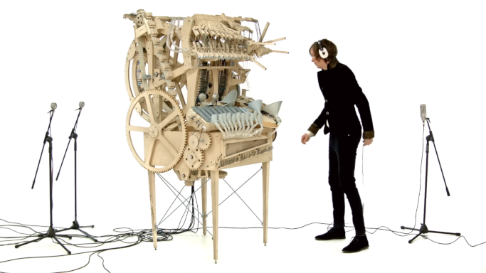

# 
Marble Machine

## 
Présentation

La partie du cours MUX101 qui m'a le plus intéressé est celle relative au traitement du son et la synthèse sonore, car c'est un domaine que je ne connaissais pas du tout.

J'ai donc cherché un moyen de concilier l'idée du flipper et de la synthèse sonore.

J'ai songé à une idée de billes qui font de la musique en tombant et j'ai tout de suite repensé à la 'Marble Machine' de [Martin Molin](https://en.wikipedia.org/wiki/Martin_Molin) visible dans la très célèbre vidéo: [Wintergatan - Marble Machine](https://www.youtube.com/watch?v=IvUU8joBb1Q)

J'essaye de reproduire le mode d'interaction de cette machine, l'utilisateur doit tourner la manivelle dans le sens horaire (je conseille l'utilisation d'une souris plutôt qu'un trackpad) et peut 'muter' les pistes de basses et de batteries.

## 
Installation

Le projet à été réalisé en utilisant [Py5](https://py5coding.org/)

Py5 étant en cours de développement, la partie sonore n'est pas encore implémentée, j'ai donc utilisé le module [mixer](https://www.pygame.org/docs/ref/mixer.html) de [PyGame](https://www.pygame.org/) pour gérer la partie sonore.

Enfin j'ai utilisé la librairie [Mido](https://mido.readthedocs.io/en/latest/index.html) pour la lecture du fichier MIDI.

### Prérequis:

- Java 17+
- Python 3.10+

Pour vérifier la version de Java installée sur le système, taper la commande suivante dans un terminal:

    java --version

Pour Python:

    python3 --version

### Unix/macOS:

Se placer dans le repertoire 'Marble_Machine' et créer un environnement virtuel 'test_projet':

    python3 -m venv test_projet

L'activer:

    source test_projet/bin/activate

Installer les librairies:

    python3 -m pip install mido pygame py5

Lancer le sketch:

    run_sketch marble_machine.py

Pour quitter, l'environnement virtuel, taper:

    deactivate

En cas de problème, d'avantage d'informations sont disponible sur le [tutoriel Python pour l'installation de packages](https://packaging.python.org/en/latest/tutorials/installing-packages/) et la page [d'installation de Py5](https://py5coding.org/content/install.html) (notamment [la page de notes relative à l'utilisation sous macOS](https://py5coding.org/content/macos_users.html))

## 
Ressources

Les samples proviennent des packs suivant:

 - [Vibraphone par atonia](https://freesound.org/people/atonia/packs/7293/) 
 - [Hoperbass par kubriel](https://freesound.org/people/kubriel/packs/16428/)
 -  [Guigui acoustic drum set par menegass](https://freesound.org/people/menegass/packs/6393/)
 
J'ai utilisé [Audacity](https://www.audacityteam.org/) pour raccourcir et rajouter une fade-out sur tous les samples, générer les samples manquants ('bass_E4.wav') en utilisant la fonction de pitch shift et générer le silence ('silence_sample.wav').

Le fichier midi est disponible dans la description de cette vidéo:
[Wintergatan - Marble Machine MIDI/Tabs whole song (Bass, Drums, Vibraphone)](https://www.youtube.com/watch?v=pNxP_0sEwF0)

Les graphismes ont été réalisés sous Paint.
