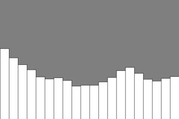
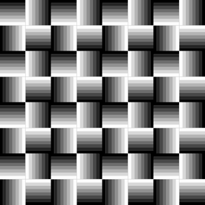
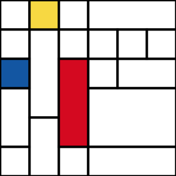
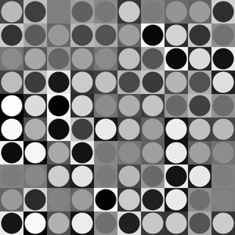
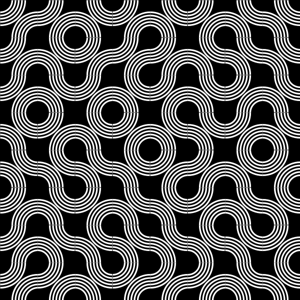
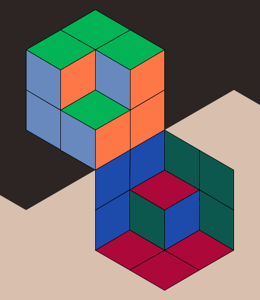
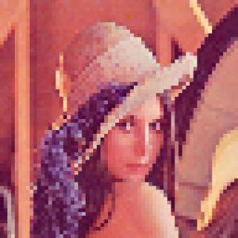
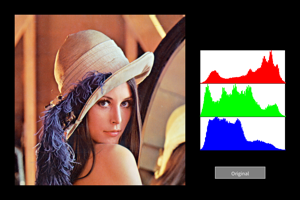

Jupyter notebooks using [py5](https://py5coding.org/) realized in the context of the CNAM Paris [MUX101 class](https://formation.cnam.fr/rechercher-par-discipline/multimedia-et-interaction-humain-machine-1085793.kjsp) 'Multimédia et interaction humain-machine'

|   |
|:---:|
|[bargraph](bargraph.ipynb)|
||
|[le_parc](le_parc.ipynb)|
||
|[mondrian](mondrian.ipynb)|
||
|[random_squares](random_squares.ipynb)|
||
|[sliders](sliders.ipynb)|
||
|[sliders_2](sliders_2.ipynb)|
||
|[truchet_tiles](truchet_tiles.ipynb)|
||
|[vasarely](vasarely.ipynb)|
||
|[vasarely_2](vasarely_2.ipynb)|
||
|[moire](moire.ipynb)|
||
|[downsampling](downsampling.ipynb)|
||
|[illusion](illusion.ipynb)|
||
|[grayscale](grayscale.ipynb)|
||
|[histogram + auto color correction](histogram.ipynb)|
||
||
|[floyd_steinberg](floyd_steinberg.ipynb)|
||
